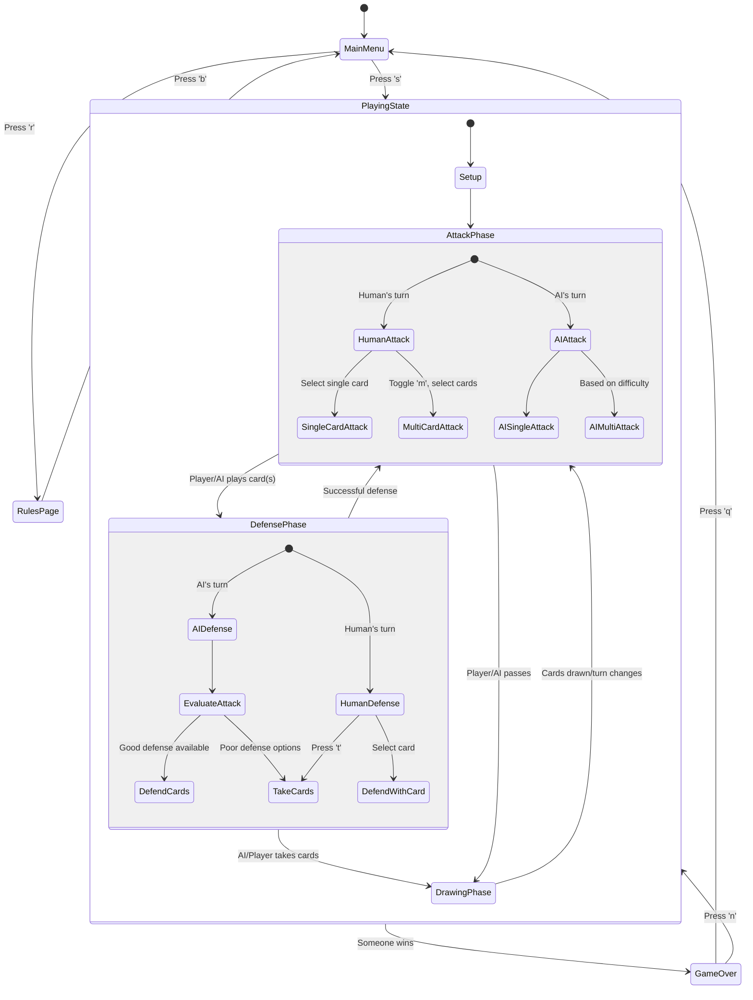

# Game State Flow in the Durak Card Game

Let me explain how the game progresses from the starting state through player actions to AI defense against multi-card attacks, based on the code provided.

## Game Flow Overview

1. **Starting State**: The game begins in the `MainMenu` state where the player can choose to start a game, view rules, or quit.

2. **Game Setup**: When the player starts a game (by pressing 's'), the game initializes with players, deals cards, and determines the trump suit.

3. **Playing Phase**: The game alternates between Attack and Defense phases.

4. **Multi-Card Attack**: A player can select multiple cards of the same rank to play as a combined attack.

5. **AI Defense**: The AI evaluates the attack and decides whether to defend against each card or take all cards.

## State Flow Diagram



## Detailed Flow Explanation

### 1. Game Initialization

When a player starts a new game:

- `App::start_game()` is called, which:
  - Sets up the game state via `game_state.setup_game()`
  - Changes the app state to `AppState::Playing`
  - Clears any selected cards
  - Checks if AI goes first and calls `process_ai_turn()` if needed

### 2. Player's Multi-Card Attack

When a player wants to make a multi-card attack:

1. Player presses 'm' to toggle multiple selection mode
2. Player navigates with arrow keys and presses space to select multiple cards of the same rank
3. Player presses Enter to play all selected cards
4. The game validates:
   - All cards must have the same rank
   - The defender must have enough cards to potentially defend
5. If valid, the cards are played from lowest to highest index
6. The game phase changes to `GamePhase::Defense`
7. Control passes to the defender (AI in this case)

From `app.rs`:

```rust
if self.multiple_selection_mode && !self.selected_cards.is_empty() {
    // Play multiple selected cards
    if *self.game_state.game_phase() == GamePhase::Attack {
        // Sort in descending order to avoid index shifting
        let mut sorted_indexes = self.selected_cards.clone();
        sorted_indexes.sort_by(|a, b| b.cmp(a));

        // Validate if the cards can be played together
        if sorted_indexes.len() > 1 {
            let hand = player.hand();
            let first_card_rank = hand[*sorted_indexes.last().unwrap()].rank;
            let all_same_rank = sorted_indexes.iter()
                .all(|&idx| hand[idx].rank == first_card_rank);

            if !all_same_rank {
                warn("Cannot play multiple cards with different ranks");
                return;
            }

            // Check if defender has enough cards
            let defender_hand_size = self.game_state.players()[self.game_state.current_defender()].hand_size();
            if sorted_indexes.len() > defender_hand_size {
                warn(format!("Cannot attack with {} cards when defender only has {} cards",
                    sorted_indexes.len(), defender_hand_size));
                return;
            }
        }

        // Try to play each card
        for &idx in sorted_indexes.iter().rev() {
            let result = self.game_state.attack(idx);
            // ... handle result
        }
    }
}
```

### 3. AI Defense Against Multi-Card Attack

When AI needs to defend against multiple attack cards:

1. `process_ai_turn()` is called after the player's attack
2. The AI identifies it's in the Defense phase
3. The AI evaluates the attacks using `should_take_cards()`
4. Based on difficulty level and card analysis, it decides to:
   - Defend against each card with the best available card
   - Take all cards if defending is too costly

From `ai.rs`:

```rust
// First count all undefended attacks initially
let initial_undefended_attacks = self.game_state.table_cards()
    .iter()
    .filter(|(_, defense)| defense.is_none())
    .count();

// Before entering the defense loop, create a complete defense plan
let should_take = self.ai_player.should_take_cards(&self.game_state, current_player_idx);

// If AI decides to take cards upfront, don't even try to defend
if should_take {
    debug("AI decided to take cards based on comprehensive analysis");
    let take_result = self.game_state.take_cards();
    // ... handle result
} else {
    // Loop and defend each card one by one
    while let Some(card_idx) = self.ai_player.make_defense_move(&mut self.game_state, current_player_idx) {
        // ... defend with the card
    }
}
```

The AI's defense strategy depends on its difficulty level:

- **Easy**: Mostly random defenses, will take cards ~50% of the time even if it can defend
- **Medium**: Uses lowest valid cards for defense, avoids using trumps when possible
- **Hard**: More strategic defense using optimal cards, considers suit counts and remaining trumps

The AI will decide to take cards based on factors like:

- If it can't defend against all attacks
- If the cost of defending (using too many high-value cards) is too high
- The number of attacks vs. hand size
- Whether it has already defended some cards

After the AI's defense (or taking cards), the game proceeds to the Drawing phase, where players replenish their hands if the deck isn't empty.

# Issues with the Current Implementation

Based on my analysis of your Durak game code, I've identified several issues that could be improved upon. Here's a detailed breakdown:

## 1. Code Duplication

There's significant code duplication in the AI decision-making logic:

```rust:src/game/ai.rs
// These two methods are nearly identical with substantial code duplication
pub fn should_take_cards(&mut self, game_state: &GameState, player_idx: usize) -> bool {
    self.should_take_cards_internal(game_state, player_idx, true)
}

pub fn should_take_cards_immutable(&self, game_state: &GameState, player_idx: usize) -> bool {
    // Instead of trying to use the mutable method, we'll reimplement the core logic here
    // This is a simplified version that doesn't update the planned_defenses
    // ... almost identical logic follows
}
```

The `should_take_cards_immutable` method reimplements most of the same logic that's in `should_take_cards_internal`, leading to maintenance challenges.

## 2. Defensive Plan Inconsistency

The AI defense planning doesn't consistently use the planned defenses:

```rust:src/game/ai.rs
// Check if we have a planned defense for this attack
if !self.planned_defenses.is_empty() {
    // Look for a defense for this specific attack card
    let planned_defense = self
        .planned_defenses
        .iter()
        .position(|(attack, _)| *attack == attacking_card);

    if let Some(plan_idx) = planned_defense {
        let (_, defense_idx) = self.planned_defenses.remove(plan_idx);
        // ... use the planned defense
    }
}
```

This creates a situation where the defense planning and execution might get out of sync, especially when defensive plans become invalid due to changes in the game state.

## 3. Nested Decision Logic

The AI decision-making logic contains deeply nested conditional statements:

```rust:src/game/ai.rs
let decision = match self.difficulty {
    AiDifficulty::Easy => {
        // Easy AI will take cards ~50% of the time if it can defend all
        if !can_defend_all {
            // ...
        } else if has_already_defended_some && remaining_hand_size <= 1 {
            // ...
        } else {
            // ...
        }
    },
    AiDifficulty::Medium => {
        // Similar nested conditions
    },
    AiDifficulty::Hard => {
        // Even more nested conditions
    }
};
```

This makes the code harder to understand, test, and maintain.

## 4. Inefficient Card Handling

The way multiple card selections are handled could be more efficient:

```rust:src/app.rs
// Sort in descending order to avoid index shifting as cards are removed
let mut sorted_indexes = self.selected_cards.clone();
sorted_indexes.sort_by(|a, b| b.cmp(a));

// Try to play each card
for &idx in sorted_indexes.iter().rev() { // Play in ascending order
    let result = self.game_state.attack(idx);
    // ...
}
```

This approach adjusts indices manually, which is error-prone. A more robust approach would be to collect the cards first, then use a different method to play them all at once.

## 5. Large Method Sizes

Several methods are excessively long, particularly:

```rust:src/app.rs
pub fn process_ai_turn(&mut self) {
    // This method spans approximately 200 lines with multiple nested loops and conditions
}

pub fn on_key(&mut self, key: KeyCode) {
    // This method spans around 300 lines with deeply nested match statements
}
```

These large methods make the code difficult to understand and maintain.

## 6. Lack of Modularity

The AI logic is tightly coupled with the main game logic. For example:

```rust:src/app.rs
// AI makes its move based on the current phase
if *self.game_state.game_phase() == GamePhase::Attack {
    // ... complex AI attack logic
} else if *self.game_state.game_phase() == GamePhase::Defense {
    // ... complex AI defense logic
}
```

This makes it difficult to test AI components independently or swap in different AI implementations.

## 7. Redundant State Checking

There's excessive repetitive state checking throughout the code:

```rust:src/app.rs
// Check if game is over after the last move
if *self.game_state.game_phase() == GamePhase::GameOver {
    // ...
}

// ... more code

// Check if game is over due to empty deck and empty hand
if self.game_state.deck().is_empty() {
    // Re-check if someone won
    // ...
}
```

This redundancy increases the risk of inconsistent state handling.

## 8. Error Handling Inconsistencies

Error handling is inconsistent across the codebase:

```rust:src/app.rs
let result = self.game_state.attack(idx);
if let Err(e) = result {
    warn(format!("Human attack failed: {}", e));
    log_warn!("Human attack failed: {}", e);
    // We don't change the game state, player can try again with a different card
} else {
    // Only process AI turn after a successful attack
    // ...
}
```

Some errors are logged but not communicated to the user, while others trigger different behavior.

## Recommendations

1. **Refactor AI Logic**:

   - Extract decision-making into smaller, focused functions
   - Use the Strategy pattern to encapsulate different AI difficulty behaviors

2. **Improve Defense Planning**:

   - Create a more robust card selection strategy
   - Consider using a dedicated struct for defense plans

3. **Enhance Modularity**:

   - Separate UI logic from game logic
   - Extract common functionality into helper methods

4. **Simplify Card Management**:

   - Create methods to handle multiple card plays atomically
   - Use card references/IDs instead of indices when possible

5. **Standardize Error Handling**:

   - Create consistent error handling patterns
   - Provide clear feedback to users

6. **Add More Tests**:
   - Write unit tests for AI decision logic
   - Test multi-card attacks and defenses specifically

If you'd like me to elaborate on any specific issue or provide a more concrete implementation suggestion for any of these points, please let me know!
